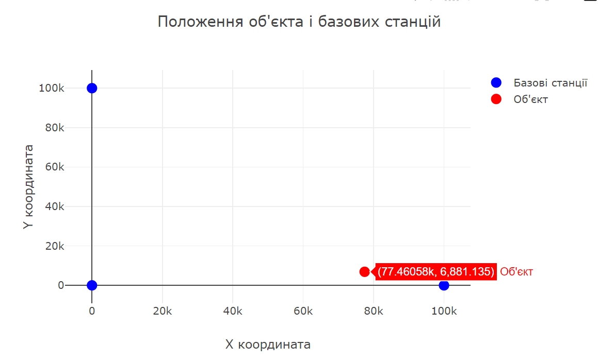

<h3>Розробка додатку для візуалізації вимірювань LORAN</h3>

<b>1. Створення початкових даних</b> 
Встановлено початкові координати для трьох базових станцій в масиві <code>stations</code>. Це дозволяє симулювати три різні точки в просторі, до яких надходять сигнали.
Створено початкове положення об'єкта в координатах <code>{x: 50000, y: 50000}</code>. Це початкова позиція об'єкта, яка буде розрахована заново під час роботи програми. 

<b>2. Метод обчислення помилок TDOA</b> 
Написана функція <code>tdoaError</code>, яка обчислює помилки між фактичними і розрахованими різницями часу прибуття сигналів між станціями та об'єктом. Вона використовує координати базових станцій і об'єкта, а також швидкість сигналу. 

<b>3. Метод найменших квадратів та градієнтний спуск</b> 
Функція <code>customLeastSquares</code> реалізує метод градієнтного спуску для мінімізації помилок TDOA і визначення положення об'єкта. Функція поступово коригує координати об'єкта, зменшуючи різницю між розрахованими та реальними TDOA. 
Градієнтний спуск використовується для пошуку мінімуму функції втрат, яка визначає сумарну помилку в розрахунках TDOA. 

<b>4. Обробка WebSocket даних</b> 
Додаток підключається до WebSocket сервера на <code>ws://localhost:4002</code>, де отримує дані про час отримання сигналів станціями. 
У функції <code>onmessage</code> розраховуються координати об'єкта на основі різниць часу прибуття сигналів <code>deltaT12</code> і <code>deltaT13</code>. Ці різниці порівнюються з розрахованими значеннями для мінімізації помилки і знаходження точного місця об'єкта. 

<b>5. Візуалізація на графіку</b> 
Використана бібліотека <code>Plotly</code>, на графіку відображаються як базові станції (сині точки), так і об'єкт (червона точка) в декартових координатах. 

<b>Результат:</b> 

